# PyTorch Rocket Yolov3 RetinaNet50, RetinaNet101 - Tutorial 2: A Tale of 3 Rockets
    Have you ever wanted to test multiple Deep Learning models and compare their results very easily?

    Are you tired of picking a Deep Learning model just because it is the only one you are able to run?

We want to solve this problem and we packaged 3 state-of-the-art Deep Learning models for Object detection for you to easily test them.

We are calling those new way of packaging Deep Learning models: __Rockets__.

__Welcome to the Rockets Scientists Community!!!__

## Install the repositories
We recommend you to use an isolated Python environement such as [virtualenv](https://virtualenv.pypa.io/en/latest/) or [conda](https://docs.conda.io/en/latest/) with at least __Python 3.6__. Then you can use the following lines of code:
```
git clone https://github.com/LucasVandroux/PyTorch-Rocket-YOLOv3-RetinaNet50-RetinaNet101
cd PyTorch-Rocket-YOLOv3-RetinaNet50-RetinaNet101
pip install rocketbase
```
### Install PyTorch
As the installation for PyTorch is different for each platform, you need to look at the [PyTorch installation guide](https://pytorch.org/get-started/locally/). Don't worry it is very simple, maximum 2 lines of codes :stuck_out_tongue_closed_eyes:

## A Tale of 3 Rockets
For this first tutorial, we selected three state-of-the-art models in Object Detection for you to play with:

1. RetinaNet with a resnet50 backbone and smaller dimension resized to 608px ___[[paper]](https://arxiv.org/pdf/1708.02002.pdf)___
2. RetinaNet with a resnet101 backbone and smaller dimension resized to 800px ___[[paper]](https://arxiv.org/pdf/1708.02002.pdf)___
3. YOLOv3 ___[[paper]](https://pjreddie.com/media/files/papers/YOLOv3.pdf)___

> Note that the RetinaNet Rocket with the resnet50 backbone can be landed using `igor/resnet`. This Rocket is the default RetinaNet Rocket. To land another version we suggest to use a specific slug such as `igor/retinanet-resnet101-800px`.

## Run the Object Detection model
Everything is happening in the `detect.py` file. There you can choose which image and model to use with just one line of code.

Once you are ready you just need to run `python detect.py` and everything will happen magically.

Don't hesitate to play around by swapping the different Rockets and comparing their output.

## Outputs of the different Rockets
| Filename | Original | RetinaNet | RetinaNet101 | YOLOv3 | Google Vision AI |
|----------|----------|-----------|-----|--------|------------------|
| `office.jpg` | 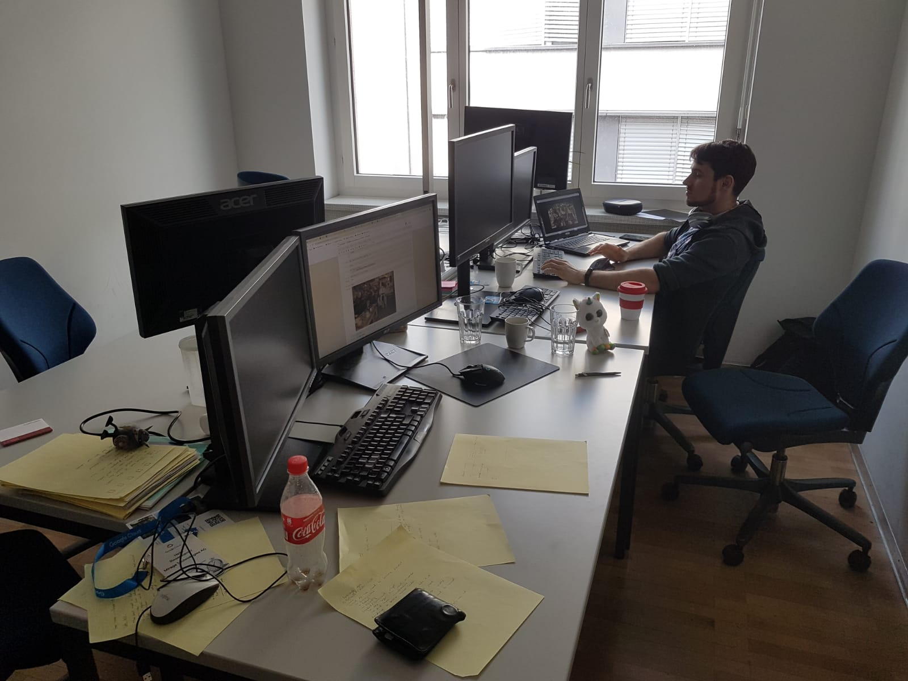|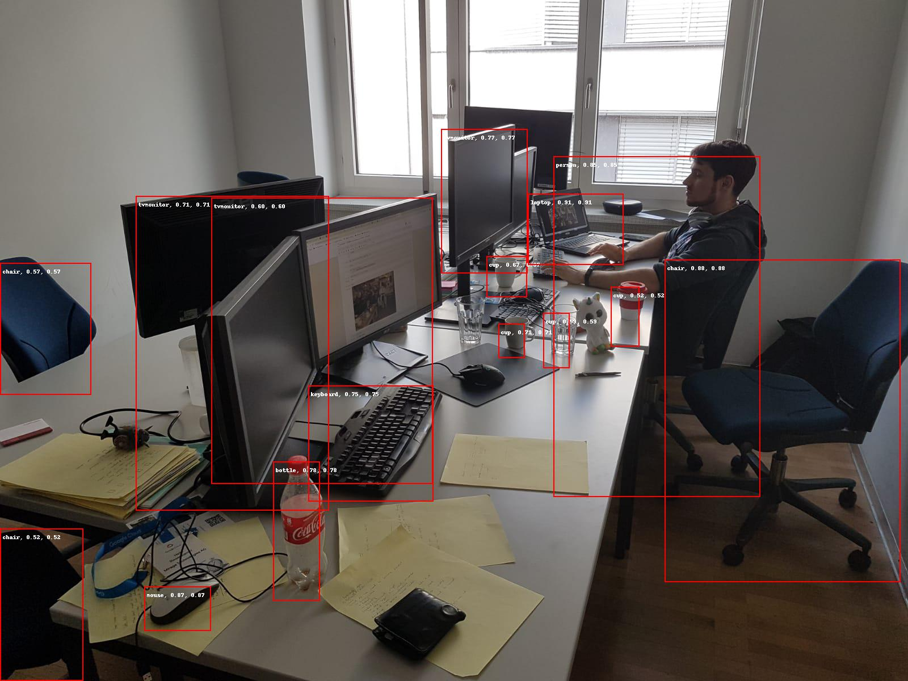|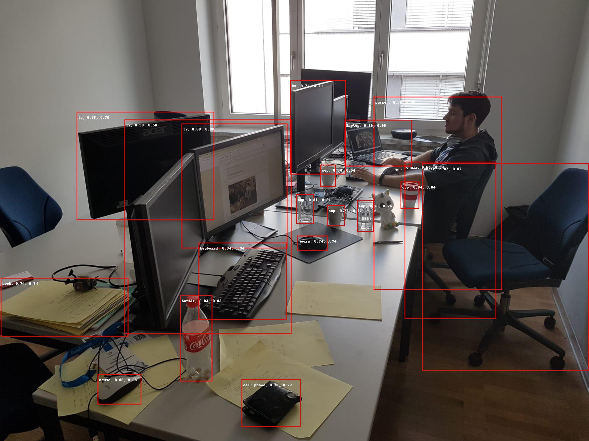|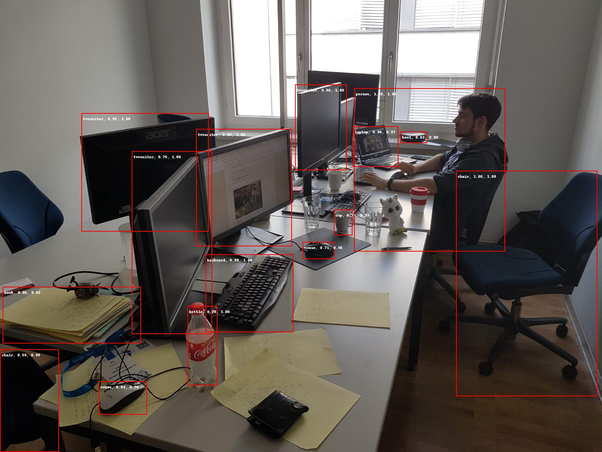||
|`shop.jpg`|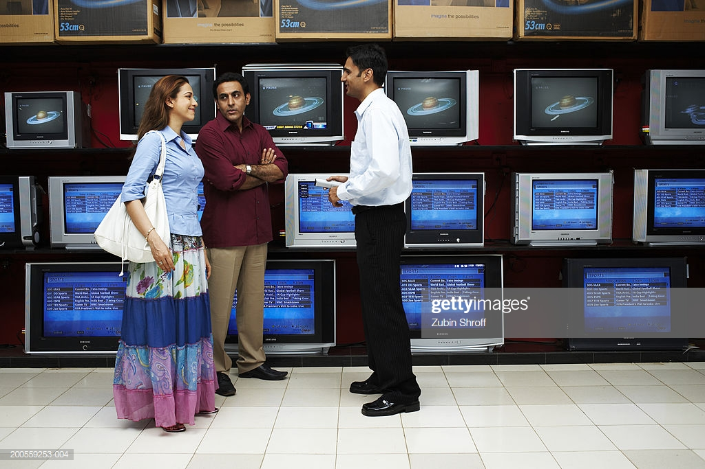||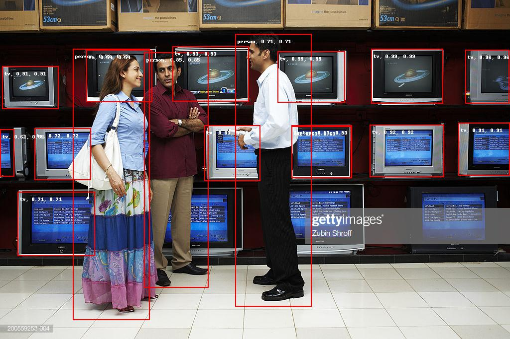|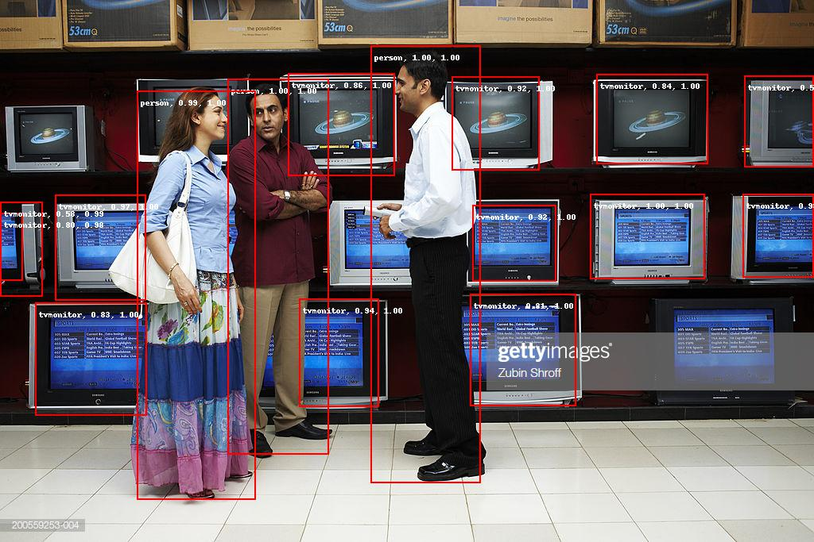|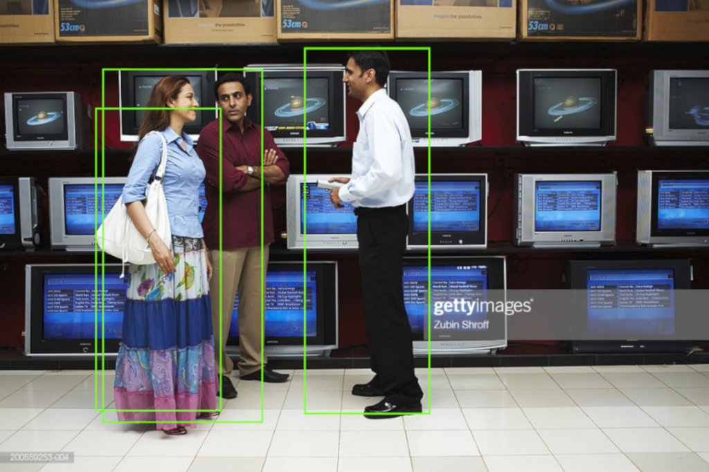|
|`street.jpg`|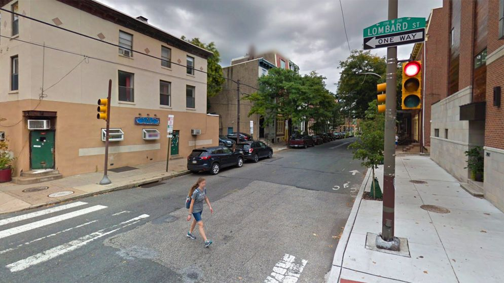||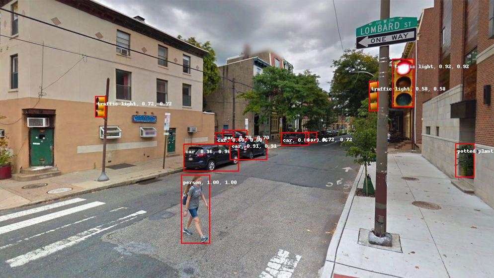|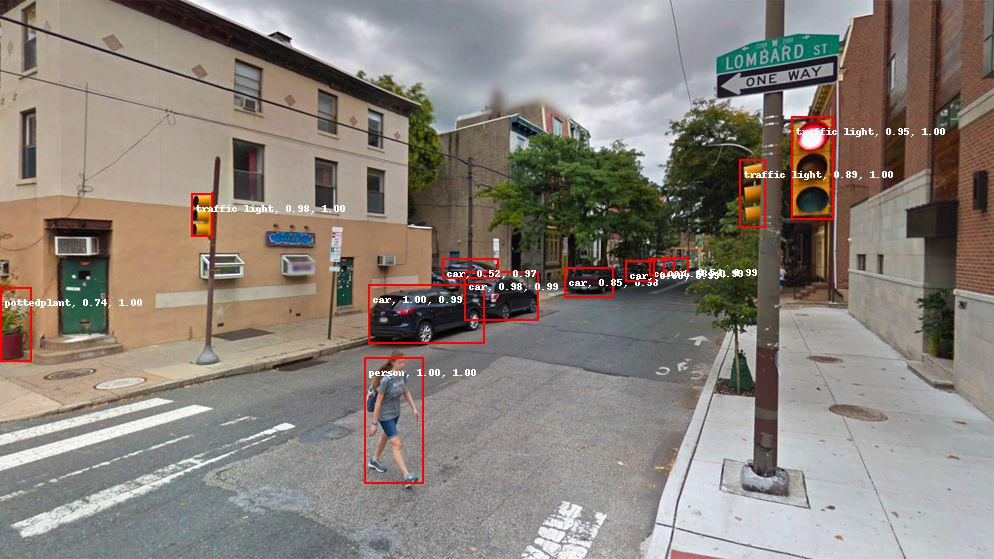|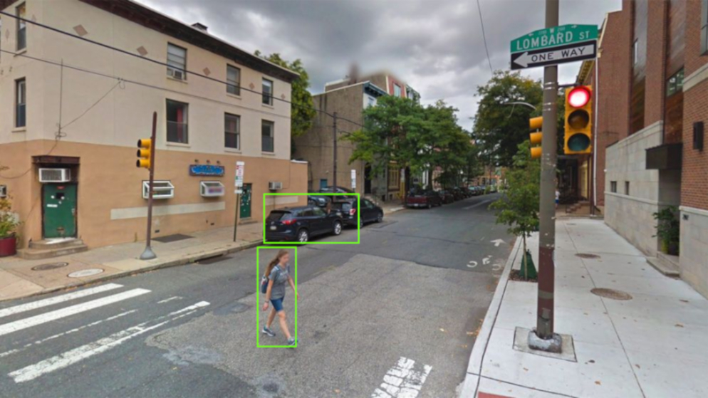|

We added the outputs from the [Google Vision AI](https://cloud.google.com/vision/) to compare with the results of our Rockets.

The Rockets are also outputting a Json formatted answer that you can use to integrate the Rockets in one of your Kickass project.

## Contact
Any feedback or complaint from your neighbors about the noise your Rockets are making, please contact us at [hello@mirage.id](mailto:hello@mirage.id). 
